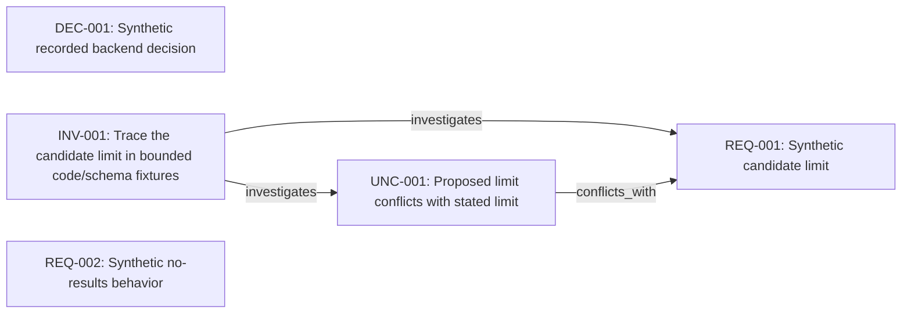

# Project map

Derived from records.json; edit records and regenerate, not this view.

```mermaid
flowchart LR
  r0["DEC-001: Synthetic recorded backend decision"]
  r1["INV-001: Trace the candidate limit in bounded code/schema fixtures"]
  r1 -->|investigates| r2
  r1 -->|investigates| r4
  r2["REQ-001: Synthetic candidate limit"]
  r3["REQ-002: Synthetic no-results behavior"]
  r4["UNC-001: Proposed limit conflicts with stated limit"]
  r4 -->|conflicts_with| r2
```
